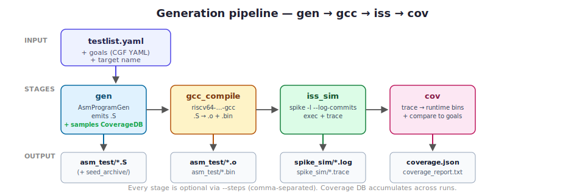

<p align="center">
  
</p>

<p align="center">
  <strong>Pure-Python RISC-V instruction generator with built-in functional coverage, auto-regression, and CI-ready dashboards.</strong>
</p>

<p align="center">
  <a href="#install"></a>
  <a href="LICENSE"></a>
  <a href="#validation"></a>
  <a href="#validation"></a>
  <a href="docs/verification-guide.md"></a>
</p>

<p align="center">
  <a href="docs/verification-guide.md"><b>Verification Guide</b></a> •
  <a href="docs/coverage.md"><b>Coverage Reference</b></a> •
  <a href="docs/architecture.md"><b>Architecture</b></a> •
  <a href="docs/testlist.md"><b>Testlist Reference</b></a> •
  <a href="docs/examples/coverage-report.html"><b>Sample HTML Report</b></a>
</p>

---

rvgen replaces the [CHIPS Alliance's riscv-dv](https://github.com/chipsalliance/riscv-dv) at the generator layer with a small, single-dependency (PyYAML) Python package. Every riscv-dv testlist YAML runs unchanged. On top of that parity, the project adds a first-class **functional-coverage subsystem** — covergroups, CGF-style goal files, coverage-directed auto-regression, per-test attribution, HTML dashboards, CI integration — that in the SV world you'd normally assemble from a UVM flow, riscv-isac, and a simulator licence.

**Who this is for:** verification engineers bringing up RISC-V cores who want the power of random instruction generation without SystemVerilog, UVM, or a simulator licence between them and their `.S` files.

---

## Table of contents

- [See it in action](#see-it-in-action)
- [Highlights](#highlights)
- [Why rvgen?](#why-rvgen)
- [Install](#install)
- [Quick start — 30 seconds](#quick-start--30-seconds)
- [Quick start — with coverage (2 minutes)](#quick-start--with-coverage-2-minutes)
- [The pipeline](#the-pipeline)
- [Functional coverage at a glance](#functional-coverage-at-a-glance)
- [Auto-regression](#auto-regression)
- [Supported ISA and targets](#supported-isa-and-targets)
- [Writing your own test](#writing-your-own-test)
- [Writing your own directed stream](#writing-your-own-directed-stream)
- [Validation](#validation)
- [Project layout](#project-layout)
- [Community](#community)
- [License](#license)
- [Citation](#citation)

---

## See it in action

**Generate, simulate, and collect coverage in one command:**

```bash
python -m rvgen \
    --target rv32imc --test riscv_rand_instr_test \
    --steps gen,gcc_compile,iss_sim,cov --iss spike --iss_trace \
    --output out/ --start_seed 100 -i 1
```

**Output (truncated):**

```text
Generated out/asm_test/riscv_rand_instr_test_0.S (seed=100, 3020 lines)
Compiling out/asm_test/riscv_rand_instr_test_0.S
Running spike: out/asm_test/riscv_rand_instr_test_0.o
2 tests passed ISS sim
Coverage DB updated: out/coverage.json
Coverage goals layered from: .../baseline.yaml
Coverage report: out/coverage_report.txt
```

**`out/coverage_report.txt`:**

```text
covergroups: 35    unique bins hit: 2970    total samples: 299604    grade: 87/100

[opcode_cg]  unique_bins=82  total_hits=10284  43/45 goals met
    ADD                             248 / 5     ✓
    SUB                             120 / 5     ✓
    ...
  MISSING (2):
    ! FENCE                            0 / 2
    ! JALR                             0 / 5
```

**The HTML dashboard** (`python -m rvgen.coverage.tools export out/coverage.json --html cov.html`):

See a real rendered example at **[`docs/examples/coverage-report.html`](docs/examples/coverage-report.html)** (self-contained, no JS, ~5k lines).

---

## Highlights

- **486 instructions** across RV32I/M/A/C/F/FC/D/DC, RV64 counterparts, Zba/Zbb/Zbc/Zbs, draft RV32B, ratified crypto (Zbkb/Zbkc/Zbkx/Zknd/Zkne/Zknh/Zksh/Zksed), and **RVV 1.0 (184 vector opcodes)**.
- **27 targets** — rv32i through rv64gcv, plus bare `rv32ui`, 4 crypto variants, and **5 Zve\* embedded-vector profiles including Google's Coral NPU** (`rv32imf_zve32x_zbb`).
- **16 directed-stream classes** — corner-value init, JAL chain, JALR pairs, loops, LR/SC, AMO, plus an SV-faithful scalar load/store family with locality / hazard / multi-page variants.
- **32 functional-coverage groups** — opcode, format, category, group, operand registers, immediates, hazards (RAW/WAR/WAW), CSR access, FP rounding, vtype, memory alignment, category and opcode transitions, register crosses, plus runtime bins (branch direction, privilege mode, CSR values, bit-activity).
- **CGF-style YAML goals** with layered overlays (baseline + per-target + per-test). 12 goal files shipped.
- **Coverage-directed auto-regression** — `--cov_directed` perturbs `gen_opts` per seed based on the currently-missing bin set. Baseline rv32imc goals close in 1 seed vs 8+ for blind seed-sweep.
- **CI-ready** — GitHub Actions integration (`GITHUB_OUTPUT` + step summary), composite 0-100 coverage grade, standardized exit codes, golden-baseline regression gate, goals linter.
- **Coverage analysis CLI** — `merge`, `diff`, `attribute`, `per-test`, `export` (CSV + HTML), `report`, `suggest-seeds`, `baseline-check`, `lint-goals`.
- **Parallel regression runner** (`scripts/regression.py`) — target × test × seed matrix execution with merged coverage + HTML dashboard.
- **One hard dependency: PyYAML.** No constraint solver. No UVM. No simulator licence.
- **Pure Python generation is fast** — 10k-instruction test in seconds; a typical matrix regression runs at ~8 seeds/sec on an 8-core laptop.

---

## Why rvgen?

| | rvgen | riscv-dv (SV/UVM) | force-riscv | riscv-isac |
|---|---|---|---|---|
| Language | **Python 3.11+** | SystemVerilog + UVM + Python glue | C++ + Python | Python |
| Simulator licence | — (open-source spike) | VCS / Questa typically required for SV | — | — |
| Install complexity | `pip install -e .` | Full EDA install + UVM libs | Build from source, C++ | `pip install riscv_isac` |
| Time to 10k-instr test | seconds | minutes (pygen: ~12 min) | seconds | n/a (post-hoc tool) |
| Instruction generation | ✓ | ✓ | ✓ | — |
| RVV 1.0 | ✓ | ✓ (recent) | ✓ | — |
| Zve\* embedded profiles | ✓ (5 targets) | — | — | — |
| Functional coverage | **built-in** (32 groups, CGF goals) | separate SV covergroup file + sim | coverage engine (C++) | **primary** (CGF-native) |
| Coverage-directed regression | ✓ (`--cov_directed`) | — (blind only) | — | — |
| Goals YAML layering + linter | ✓ | — | — | partial |
| HTML coverage dashboard | ✓ (built-in) | UCIS + vendor tool | — | partial |
| CI integration (GITHUB_OUTPUT + grade) | ✓ | — | — | — |
| New-test creation | edit YAML | edit YAML + possibly SV class | edit XML | n/a |

**The summary:** if you already have a commercial SV flow, riscv-dv is still the richest framework. If you don't — or if you're running a CI workflow where "pip install + run" matters — rvgen gives you random instruction generation, the same testlist format, **and a complete coverage workflow** in one open-source package.

---

## Install

From PyPI:

```bash
pip install rvgen
```

Or from source (for development):

```bash
git clone https://github.com/LogicX-Tatsu/rvgen.git
cd rvgen
pip install -e ".[test]"
```

**Runtime dependencies** (external tools):

| Tool | Used for | Env var |
|------|----------|---------|
| `riscv64-unknown-elf-gcc` | Assemble `.S` → ELF | `$RISCV_GCC` |
| `riscv64-unknown-elf-objcopy` | ELF → raw binary | resolved next to GCC |
| `spike` (ISA simulator) | Execute ELF + emit trace | `$SPIKE_PATH` |
| `spike-vector` | For RVV / Zve* targets | `$SPIKE_PATH` |

Toolchain setup guides: [SiFive freedom-tools](https://github.com/sifive/freedom-tools) / [riscv-gnu-toolchain](https://github.com/riscv-collab/riscv-gnu-toolchain) / [spike](https://github.com/riscv-software-src/riscv-isa-sim).

---

## Quick start — 30 seconds

Just generate an assembly file (skip GCC and spike):

```bash
python -m rvgen \
    --target rv32imc --test riscv_arithmetic_basic_test \
    --testlist /path/to/riscv-dv/target/rv32imc/testlist.yaml \
    --steps gen --output out/ --start_seed 100 -i 1
```

Output: `out/asm_test/riscv_arithmetic_basic_test_0.S`. Inspect it, assemble it with your own toolchain, run it where you want.

---

## Quick start — with coverage (2 minutes)

End-to-end: generate → assemble → simulate → collect static + runtime coverage:

```bash
export RISCV_GCC=/path/to/riscv64-unknown-elf-gcc
export SPIKE_PATH=/path/to/spike

python -m rvgen \
    --target rv32imc --test riscv_rand_instr_test \
    --testlist /path/to/riscv-dv/target/rv32imc/testlist.yaml \
    --steps gen,gcc_compile,iss_sim,cov --iss spike --iss_trace \
    --output out/ --start_seed 100 -i 1
```

Open the report:

```bash
# text (terminal-friendly)
less out/coverage_report.txt

# or self-contained HTML
python -m rvgen.coverage.tools export out/coverage.json \
    --html out/coverage.html
xdg-open out/coverage.html
```

See **[`docs/verification-guide.md`](docs/verification-guide.md)** for the complete tutorial.

---

## The pipeline



Every stage is optional via `--steps`. Coverage accumulates across runs when you re-use the same `coverage.json` path (`--cov_db`).

---

## Functional coverage at a glance


32 covergroups sampled from two sources:

- **Static** (at generation): opcode / format / category / group / rs1 / rs2 / rd / imm_sign / imm_range / hazard / csr / csr_access / fp_rm / vreg / vtype / mem_align / load_store_width / load_store_offset / category_transition / opcode_transition / rs1==rs2 / rs1==rd / directed_stream + 2 crosses.
- **Runtime** (from spike `-l --log-commits`): branch_direction + branch×mnemonic / exception / privilege_mode / pc_reach / csr_value / rs_val_corner / bit_activity + `opcode_cg.*__dyn`.

**Goals** are CGF-style YAML. Layered overlays, auto-resolved from `goals/<target>.yaml`, linted for typos.

**Complete reference:** [`docs/coverage.md`](docs/coverage.md).

---

## Auto-regression

`--auto_regress` loops seeds until goals are met or a plateau is detected:


```bash
python -m rvgen \
    --target rv32imc --test riscv_rand_instr_test \
    --auto_regress --cov_directed --max_seeds 16 \
    --output out/regress/
```

Coverage-directed (`--cov_directed`) mode inspects the currently-missing bin set and perturbs `gen_opts` per seed — dropping `+no_fence=1` if FENCE is missing, injecting `riscv_load_store_rand_instr_stream` if LB/LH aren't hit, etc. Result: baseline rv32imc goals close in **1 seed** vs **8+** for blind sweep.

Bookkeeping: `convergence.json` (per-bin first-hit seed), `cov_timeline.json` (time-series), ASCII sparkline in the log, rotating per-seed `.S` snapshots in `asm_test/seed_archive/`.

---

## Supported ISA and targets

**Instructions (486 total):**

| Group | Count | Notes |
|---|---:|---|
| RV32I / RV64I | 62 | base + W-width |
| RV32M / RV64M | 13 | mul / div |
| RV32A / RV64A | 22 | LR/SC + AMO |
| RV32F / RV64F / RV32D / RV64D | 60 | + FCVT + FMV |
| RV32FC / RV32DC | 8 | compressed FP load/store |
| RV32C / RV64C | 35 | base compressed |
| Zba / Zbb / Zbc / Zbs | 30 | ratified bit-manip |
| Zbkb / Zbkc / Zbkx | 6 | crypto bit-manip |
| Zknd / Zkne / Zknh | 19 | AES + SHA |
| Zksh / Zksed | 4 | SM3 / SM4 |
| RV32B (draft) | 40 | for historical compatibility |
| **RVV 1.0** | **184** | integer + FP + widening/narrowing + mask + reductions + loads/stores + AMO |

**Targets (27):**

```
rv32i        rv32im        rv32ic        rv32ia       rv32iac      rv32imac
rv32imc      rv32if        rv32imafdc    rv32imcb     rv32imc_sv32 rv32ui
rv32imc_zkn  rv32imc_zkn_zks  rv32imc_zve32x  rv32imfc_zve32f
rv64imc      rv64imcb      rv64imc_zkn   rv64imafdc   rv64gc       rv64gcv
rv64imc_zve64x  rv64imafdc_zve64d
coralnpu     ml            multi_harts
```

Targets are declarative — adding a new one is a single `TargetCfg(...)` entry plus a `(isa, mabi)` pair in `cli.py`.

---

## Writing your own test

Entirely YAML. No Python needed.

```yaml
# my_tests.yaml
- test: my_hazard_heavy_test
  description: "Force hazards via tight reg pool + directed hazard streams."
  iterations: 4
  gen_test: riscv_instr_base_test
  gen_opts: >
    +instr_cnt=8000
    +num_of_sub_program=3
    +directed_instr_0=riscv_hazard_instr_stream,6
    +directed_instr_1=riscv_load_store_hazard_instr_stream,6
    +no_csr_instr=0
  rtl_test: core_base_test
```

Run:

```bash
python -m rvgen --target rv32imc --test my_hazard_heavy_test \
    --testlist my_tests.yaml --steps gen,gcc_compile,iss_sim,cov --iss spike \
    --output out/ -i 4 --start_seed 100
```

**Full plusarg reference** and the directed-stream catalogue: [`docs/testlist.md`](docs/testlist.md).

---

## Writing your own directed stream

If gen_opts isn't enough, a new stream is ~20 lines of Python. See [`docs/examples/custom-stream.py`](docs/examples/custom-stream.py) for a complete annotated template.

```python
@dataclass
class MyBurstStream(DirectedInstrStream):
    def build(self) -> None:
        for _ in range(10):
            instr = get_instr(RiscvInstrName.ADD)
            instr.rs1 = instr.rd = RiscvReg.T0  # in-place accumulator
            instr.rs2 = self.rng.choice([r for r in RiscvReg
                                         if r not in self.cfg.reserved_regs])
            instr.post_randomize()
            self.instr_list.append(instr)

register_stream("my_burst_stream", MyBurstStream)
```

Reference it from any testlist:

```yaml
gen_opts: >
  +directed_instr_0=my_burst_stream,5
```

---

## Validation

All green at the tip of main:

- **332** unit tests (`python -m pytest tests/ -q`).
- **51/51** scalar end-to-end on spike (17 tests × 3 seeds across rv32imc / rv32imafdc / rv32imcb / rv64imc / rv64imcb).
- **18/18** vector end-to-end on spike-vector (6 tests × 3 seeds on rv64gcv).
- **5/5** Zve\*-profile end-to-end (coralnpu / rv32imc_zve32x / rv32imfc_zve32f / rv64imc_zve64x / rv64imafdc_zve64d).
- **21/21** instruction-by-instruction trace matches against the [chipforge-mcu](https://chipforge.io) RV32IMC+Zkn RTL (7 tests × 3 seeds, via `scripts/mcu_validate.sh`).
- **1** integration-regression test pinning the fixed-seed rv32imc run against a known coverage floor.

**Reproduce the scalar sweep:**

```bash
for t in rv32imc:riscv_arithmetic_basic_test rv32imc:riscv_rand_instr_test \
         rv32imc:riscv_jump_stress_test rv32imc:riscv_loop_test \
         rv32imc:riscv_amo_test rv32imc:riscv_rand_jump_test \
         rv32imc:riscv_no_fence_test rv32imc:riscv_mmu_stress_test \
         rv32imc:riscv_unaligned_load_store_test \
         rv32imafdc:riscv_floating_point_arithmetic_test \
         rv32imcb:riscv_b_ext_test rv32imcb:riscv_zbb_zbt_test \
         rv64imc:riscv_arithmetic_basic_test rv64imc:riscv_rand_instr_test \
         rv64imc:riscv_loop_test rv64imc:riscv_jump_stress_test \
         rv64imcb:riscv_b_ext_test; do
  target=${t%%:*}; test=${t##*:}
  for s in 100 200 300; do
    python -m rvgen --target $target --test $test \
        --steps gen,gcc_compile,iss_sim --iss spike \
        --output /tmp/reg_${target}_${test}_${s} --start_seed $s -i 1 2>&1 \
      | grep -qE "tests passed ISS sim" \
      && echo "PASS $target/$test/$s" || echo "FAIL $target/$test/$s"
  done
done
```

Expected: 51 `PASS`.

---

## Project layout

```
rvgen/            # main package
├── cli.py                       # entry point: python -m rvgen
├── auto_regress.py              # --auto_regress loop + convergence tracking
├── config.py                    # Config dataclass, plusarg parsing
├── targets/__init__.py          # 27 TargetCfg entries
├── testlist.py                  # YAML loader (riscv-dv schema compatible)
├── seeding.py                   # SeedGen: fixed/start/rerun/random
├── isa/                         # per-extension instruction modules
│   ├── base.py                   # Instr base class
│   ├── rv32i.py, rv32m.py ...    # scalar registrations
│   ├── bitmanip.py, crypto.py    # Zb* / Zk* registrations
│   ├── rv32v.py                  # RVV 1.0 registrations
│   ├── floating_point.py         # FP base class
│   ├── vector.py                 # VectorInstr base class + factory
│   ├── factory.py                # INSTR_REGISTRY + define_instr()
│   └── filtering.py              # create_instr_list + get_rand_instr
├── stream.py, sequence.py        # instr-stream + sequence machinery
├── asm_program_gen.py            # top-level .S composer
├── streams/                      # directed streams
│   ├── base.py, directed.py, loop.py, amo_streams.py, load_store.py
├── privileged/                   # boot CSR + trap handlers
├── sections/                     # data pages, signature, stack
├── gcc.py, iss.py                # external-tool wrappers (GCC + spike)
├── coverage/                     # functional-coverage subsystem
│   ├── collectors.py              # 32 covergroups + sample_*
│   ├── runtime.py                 # spike-trace parser
│   ├── cgf.py                     # goals YAML loader
│   ├── directed.py                # auto-regress perturbation table
│   ├── report.py                  # text report + composite grade
│   ├── tools.py                   # merge/diff/attribute/export CLI
│   └── goals/*.yaml               # 12 shipped goal overlays
└── vector_config.py              # VectorConfig + Vtype + legal_eew

docs/                            # deep documentation
├── verification-guide.md         # 9-section tutorial
├── coverage.md                   # complete coverage reference
├── architecture.md               # module / data flow
├── testlist.md                   # gen_opts + stream reference
├── releasing.md                  # PyPI release checklist
├── images/                       # SVG diagrams
└── examples/                     # coverage HTML, annotated goals, custom stream

scripts/
├── regression.py                 # parallel matrix runner
└── mcu_validate.sh               # chipforge-mcu trace-compare driver

tests/unit/                      # 332 unit tests
```

---

## Community

- **Bug reports**: [open an issue](../../issues/new?template=bug_report.md) with a reproducer.
- **Feature requests**: [feature template](../../issues/new?template=feature_request.md).
- **Security**: email the maintainer directly (do not open a public issue).
- **Contributing**: [`CONTRIBUTING.md`](CONTRIBUTING.md) — workflow, commit style, PR checklist.
- **Code of conduct**: [`CODE_OF_CONDUCT.md`](CODE_OF_CONDUCT.md) (Contributor Covenant 2.1).
- **Changelog**: [`CHANGELOG.md`](CHANGELOG.md).

---

## License

[Apache 2.0](LICENSE) — same permissive licence as riscv-dv. Free to use commercially, modify, redistribute.

---

## Citation

If you use rvgen in academic work, see [`CITATION.cff`](CITATION.cff) for the canonical citation.

---

## Acknowledgements

- Structurally inspired by [riscv-dv](https://github.com/chipsalliance/riscv-dv) — the SystemVerilog reference we ported.
- CGF goals format from [riscv-isac](https://github.com/riscv-verification/riscvISACOV).
- Spike, the RISC-V ISA simulator we validate against.

This project is not affiliated with the RISC-V Foundation, Google, or the chipsalliance organisation.
