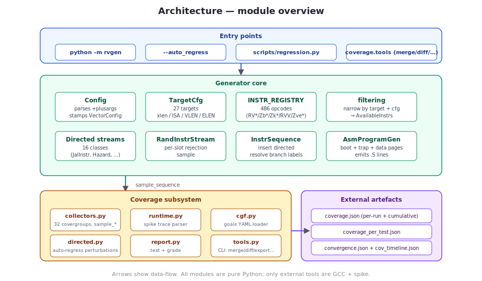

# Architecture

A single-process, single-threaded Python program. No constraint solver,
no UVM factory, no external simulator dependencies at generation time
— GCC and spike are invoked by subprocesses only in the `gcc_compile`
and `iss_sim` steps respectively.

## Module inventory

All source under `rvgen/`:

| Module | Responsibility |
|---|---|
| `cli.py` | argparse entry point (`python -m rvgen ...`). Orchestrates the `gen,gcc_compile,iss_sim,cov` steps and wires `--auto_regress` to the dedicated driver. |
| `auto_regress.py` | The `--auto_regress` loop: seed-bumping, coverage-directed perturbation, convergence tracking, plateau detection, per-seed asm archival. |
| `config.py` | `Config` dataclass — every riscv-dv plusarg knob, plus our extensions. Parses `+key=value` strings. Stamps `VectorConfig` when the target advertises a vector profile. |
| `targets/__init__.py` | Declarative `TargetCfg` table — 27 targets covering rv32i through rv64gcv plus Zve*/coralnpu embedded profiles. |
| `testlist.py` | riscv-dv-format YAML loader with `<riscv_dv_root>` substitution + recursive `import:` support. |
| `seeding.py` | `SeedGen` — fixed / start / rerun / random modes. |
| `isa/` | Per-extension instruction modules (rv32i, rv32m, rv32f, bitmanip, crypto, rv32v, ...). Each calls `define_instr(name, format, category, group)` to register into the global `INSTR_REGISTRY`. |
| `isa/base.py` | `Instr` base class — operand slots, `set_rand_mode`, `set_imm_len`, `randomize_imm`, `convert2asm`, `convert2bin`. |
| `isa/filtering.py` | `create_instr_list(cfg)` narrows the global registry by target + config flags into an `AvailableInstrs` view. `get_rand_instr(...)` picks from it subject to include/exclude sets. |
| `stream.py` | `InstrStream` (ordered list) + `RandInstrStream` (randomized). Handles `insert_instr_stream`, `mix_instr_stream`. |
| `sequence.py` | `InstrSequence` — wraps a `RandInstrStream`, injects directed streams at random non-atomic positions, then resolves numeric branch labels to byte offsets. |
| `asm_program_gen.py` | Top-level `.S` composer — emits header, boot (misa + pre_enter_privileged_mode), init (GPR distribution + FP init + vector init), main sequence, trap handlers, data pages, kernel stack. |
| `privileged/` | Boot CSR sequencing + trap handler DIRECT/VECTORED generation. |
| `sections/` | Data page emission, signature-handshake, stack layout. |
| `streams/` | Directed instruction streams. Each is a `DirectedInstrStream` subclass that populates an atomic `instr_list` and is registered by riscv-dv-compatible SV class name. |
| `gcc.py` | Locates `riscv64-unknown-elf-gcc`, invokes it per test, runs objcopy for binaries. |
| `iss.py` | Locates `spike`, runs each `.o`, optionally captures `-l --log-commits` trace. |
| `coverage/` | Functional-coverage subsystem — see [`coverage.md`](coverage.md). |

## Data flow

1. **Input**: `testlist.yaml` + `--target <name>` + optionally `--cov_goals`
   files.
2. **Config build**: for each `TestEntry`, `make_config(target_cfg,
   gen_opts=...)` constructs a `Config`. Target-specific defaults
   (e.g. VectorConfig stamped when target has RVV or Zve*) are applied.
3. **Instruction catalog**: `create_instr_list(cfg)` narrows the global
   486-opcode registry to the subset this target + config allows
   (xlen filter, unsupported_instr filter, no_fence/no_csr gates, vector
   subset gating).
4. **Sequence generation**: `AsmProgramGen.gen_program()` emits the `.S`.
   Internally:
   - Boot section (misa + mret).
   - Init section (GPR distribution, FP init, vector init).
   - Main sequence — a `RandInstrStream` that picks from the allowed set
     per slot (rejection-sampling), then `InstrSequence` inserts each
     directed stream at a random non-atomic position and resolves branch
     labels.
   - Trap handlers (DIRECT by default; VECTORED when `cfg.mtvec_mode`).
   - Data pages, AMO region, kernel/user stacks.
5. **Coverage sampling** (if the `cov` step is requested): the main
   sequence's instr list is fed to `sample_sequence(db, instr_list,
   vector_cfg=cfg.vector_cfg)`. If `iss_sim` ran with `--iss_trace`,
   `sample_trace_file(db, trace)` also ingests the spike log.
6. **Compile + sim**: the `.S` is written to disk, then `gcc_compile`
   and `iss_sim` invoke the respective external tools via subprocess.
7. **Report**: `render_report(db, goals)` produces the human-readable
   summary; `compute_grade(db, goals)` computes the 0-100 grade.

## Design decisions

**No constraint solver.** riscv-dv relies on UVM's constrained-random
framework. We considered PyVSC but rejected it: the problems it solves
are mostly "pick a register uniformly from this set minus those" which
is fine with `random.choice` + a filter, and PyVSC adds a heavy z3
dependency that makes the tool slow and fragile to install. Rejection
sampling in a plain `random.Random` takes microseconds per instruction;
a 10k-instruction test generates in seconds.

**One `Instr` subclass per opcode, registered at import time.** Mirrors
SV's `DEFINE_INSTR` macro expansion. Lookup is `dict[RiscvInstrName,
Type[Instr]]` — O(1). No UVM factory, no string-based reflection.

**ISA extensions are Python modules.** `isa/rv32i.py`, `isa/rv32f.py`,
`isa/bitmanip.py`, `isa/crypto.py`, `isa/rv32v.py`. Adding a new
extension = write a new module that calls `define_instr(...)` for each
opcode + add the group to `RiscvInstrGroup`. No core changes needed.

**Streams are classes, not closures.** `DirectedInstrStream` subclasses
override `build()` to populate `instr_list`. Registration via
`register_stream("riscv_my_stream", MyStream)` so testlists reference
them by SV class name.

**Coverage is a pure-data concern.** `CoverageDB` is a dict-of-dict.
Sampling functions are plain functions. Goals are YAML. Tools are CLI
subcommands. Nothing is class-heavy.

**Directed feedback is opt-in.** `--auto_regress` alone is blind seed-
sweep; `--auto_regress --cov_directed` engages the perturbation table.
Users who want fully-random regression don't pay for the intelligence
they don't want.

## Testing

| Test kind | Where | Count |
|---|---|---|
| Unit | `tests/unit/` | 396 |
| Doctest (coverage API example) | `rvgen/coverage/__init__.py` | 1 |
| End-to-end on spike (51-case scalar) | `scripts/regression.py` + `docs/releasing.md` loop | 51 × 3 seeds |
| End-to-end on spike-vector (rv64gcv) | `scripts/regression.py --targets rv64gcv` | 18 × 3 seeds |
| End-to-end on spike-vector (Zve* + coralnpu) | `scripts/regression.py --targets coralnpu,rv32imc_zve32x,…` | 5 |
| Trace-level match vs chipforge-mcu RTL | `scripts/mcu_validate.sh` | 7 × 3 seeds |
| Integration regression (golden bin floor) | `tests/unit/test_coverage.py::test_golden_coverage_rv32imc_fixed_seed` | 1 |

All green at the tip of main.

## Extending

| Goal | Where to change |
|---|---|
| Add a new opcode | `rvgen/isa/<ext>.py` — call `define_instr(name, format, category, group)`. |
| Add a new extension group | `isa/enums.py::RiscvInstrGroup` + new module that registers opcodes. |
| Add a new target | `targets/__init__.py::_TARGETS` — add a `TargetCfg` entry. Update `cli.py::_TARGET_ISA_MABI` for GCC. |
| Add a new directed stream | `streams/<my_stream>.py` — subclass `DirectedInstrStream`, call `register_stream("riscv_my_stream", cls)`. Reference from testlist gen_opts. |
| Add a new covergroup | `coverage/collectors.py` — add `CG_*` constant + to `ALL_COVERGROUPS` + sample it in `sample_instr` or `sample_sequence`. |
| Add a new plusarg | `config.py::Config` — add the field; `apply_plusarg` picks it up generically. |
| Add a new goals overlay | `coverage/goals/<name>.yaml` — layer via `--cov_goals`. |

Each extension path is independent — changes in one area don't ripple.
