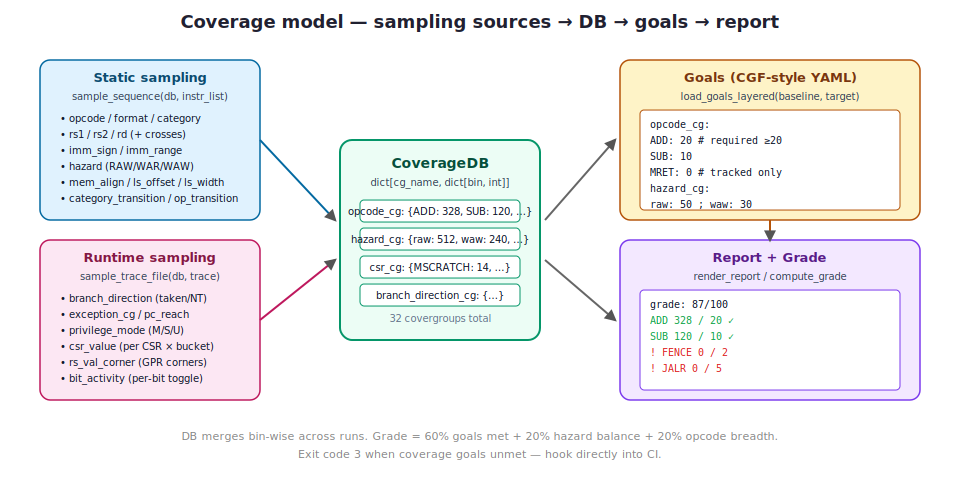
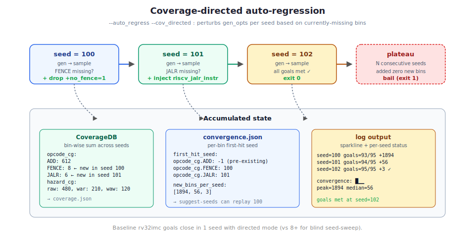

# Functional coverage — complete reference

> Complementary to [`docs/verification-guide.md`](verification-guide.md), which
> is a **tutorial** (do this, then this, then this). This doc is a **reference**
> — it enumerates every covergroup, every goal-file key, every CLI tool, and
> walks through worked examples end-to-end.

## Contents

1. [Why functional coverage](#1-why-functional-coverage)
2. [The data model](#2-the-data-model)
3. [Covergroup catalogue](#3-covergroup-catalogue)
4. [Goals (CGF-style YAML)](#4-goals-cgf-style-yaml)
5. [Collecting coverage](#5-collecting-coverage)
6. [Reports and dashboards](#6-reports-and-dashboards)
7. [Analysis tools](#7-analysis-tools)
8. [Auto-regression](#8-auto-regression)
9. [CI integration](#9-ci-integration)
10. [Worked examples](#10-worked-examples)
11. [Extending the model](#11-extending-the-model)

---

## 1 — Why functional coverage

Random-instruction regression without coverage is "we ran a lot of tests and
nothing crashed". Coverage turns that into **"we exercised every case we
care about at least N times"**, which is what tape-out sign-off actually
requires.

chipforge-inst-gen ships a pure-Python coverage model inspired by two
industry-standard references:

- **riscv-dv's SystemVerilog covergroups** — the *what* (which bins
  matter). We port the same categories: opcodes, operands, hazards, CSRs,
  privilege transitions, vector types, etc.
- **riscv-isac's [CGF](https://riscv-isac.readthedocs.io/en/latest/cgf.html)
  format** — the *how* (user-written goals as YAML). We're source-schema
  compatible with CGF and add layered-overlay support.

No simulator licences required; no SV toolchain; no PyVSC constraint
solver. Just a Python dict-of-dict that's trivial to JSON-dump, merge,
diff, export, and gate CI on.



---

## 2 — The data model

A `CoverageDB` is a plain dict-of-dict:

```python
CoverageDB = dict[str, dict[str, int]]
# { covergroup_name: { bin_name: observed_hit_count } }
```

This shape:

- **Serialises trivially** to JSON / YAML.
- **Merges by bin-wise addition** — `merge(dst, src)` sums counts.
- **Compares cleanly** against a `Goals` object (also dict-of-dict but
  with *required* hit counts instead of observed).

Two complementary sampling entry points:

```python
from chipforge_inst_gen.coverage import (
    sample_sequence,    # static — from the emitted instr list
    sample_trace_file,  # runtime — from spike's --log-commits output
)
```

Call either or both; both write into the same CoverageDB.

---

## 3 — Covergroup catalogue

32 covergroups in total (18 static + 10 runtime + 4 crosses).

### Static (sampled from the generator's instr list)

| Covergroup | Bins | Source |
|---|---|---|
| `opcode_cg` | Every `RiscvInstrName` enum member. | `sample_instr` |
| `format_cg` | `R_FORMAT`, `I_FORMAT`, `S_FORMAT`, `B_FORMAT`, `U_FORMAT`, `J_FORMAT`, `C*_FORMAT`, `V*_FORMAT` | `instr.format` |
| `category_cg` | `LOAD`, `STORE`, `ARITHMETIC`, `LOGICAL`, `COMPARE`, `SHIFT`, `BRANCH`, `JUMP`, `SYNCH`, `SYSTEM`, `CSR`, `AMO`, `TRAP`, `INTERRUPT`, `COUNTER`, `CHANGELEVEL` | `instr.category` |
| `group_cg` | `RV32I`, `RV32M`, …, `RVV`, `ZVE32X`, `ZVE64D`, `RV32ZBB`, `RV32ZKNH`, … (45 groups) | `instr.group` |
| `rs1_cg`, `rs2_cg`, `rd_cg` | `ZERO`..`T6` (x0..x31 ABI names). Only bumped when `has_rs*` / `has_rd` set. | operand slots |
| `imm_sign_cg` | `pos` / `neg` / `zero` (only when `has_imm` and `imm_len > 0`). | sign bit |
| `imm_range_cg` | `zero` / `all_ones` / `walking_one` / `walking_zero` / `min_signed` / `max_signed` / `generic` | bit-pattern classify |
| `hazard_cg` | `raw` / `war` / `waw` / `none` across an 8-instruction sliding window. x0 writes correctly ignored. | inter-instr |
| `csr_cg` | Every `PrivilegedReg` name touched by a CSR op. | `CsrInstr.csr` |
| `csr_access_cg` | `<CSR>__read` / `<CSR>__write`. CSRRS/C with rs1=x0 is read-only; CSRRW always writes. | access type |
| `fp_rm_cg` | `RNE` / `RTZ` / `RDN` / `RUP` / `RMM` (FP ops only) | `instr.rm` |
| `fpr_cg` | `FT0`..`FT11`, `FS0`..`FS11`, `FA0`..`FA7` (when `has_fs*` / `has_fd`) | FP operand slots |
| `vreg_cg` | `V0`..`V31` (when `has_vs*` / `has_vd`) | vector operand slots |
| `vtype_dyn_cg` | `SEW<w>_M<lmul>` or `SEW<w>_MF<lmul>` — active vtype when a vector op is emitted. | vector_cfg |
| `mem_align_cg` | `byte_aligned` / `half_{aligned,unaligned}` / `word_{aligned,unaligned}` / `dword_{aligned,unaligned}` | offset × width |
| `load_store_width_cg` | `byte` / `half` / `word` / `dword` | load/store width |
| `load_store_offset_cg` | `zero` / `pos_{small,medium,large}` / `neg_{small,medium,large}` | offset magnitude |
| `rs1_eq_rs2_cg` | `equal` / `distinct` | same-reg path detection |
| `rs1_eq_rd_cg` | `equal` / `distinct` | in-place op detection |
| `category_transition_cg` | `<prev_cat>__<cur_cat>` e.g. `BRANCH__LOAD` — pipeline-stall hints | adjacent-instr |
| `opcode_transition_cg` | `<prev_mnem>__<cur_mnem>` — fine-grained sequencing | adjacent-instr |
| `directed_stream_cg` | One bin per directed-stream name whose first instr carries the `Start <name>` comment. | stream finalize |

### Crosses

| Covergroup | Bins |
|---|---|
| `fmt_category_cross` | `<format>__<category>` e.g. `R_FORMAT__ARITHMETIC` |
| `category_group_cross` | `<category>__<group>` e.g. `ARITHMETIC__RV32I` |
| `rs1_rs2_cross_cg` | 1024 possible `(rs1, rs2)` pairs |
| `rd_rs1_cross_cg` | 1024 possible `(rd, rs1)` pairs |

### Runtime (from `spike -l --log-commits` trace)

Enabled with `--iss_trace`. Spike emits two lines per retired instruction
(trace + commit); the parser ingests both.

| Covergroup | Bins | Extracted from |
|---|---|---|
| `branch_direction_cg` | `taken` / `not_taken` | compare next PC to fall-through |
| `branch_taken_per_mnem_cg` | `BEQ__T`, `BEQ__NT`, `BNE__T`, ... | per-mnemonic × direction |
| `exception_cg` | `trap_entered` | entry into `mtvec_handler` etc. |
| `privilege_mode_cg` | `M_entered` / `M_return` / `S_return` / `U_return` / `M_mode` / `S_mode` / `U_mode` | MRET/SRET/URET + priv digit in commit line |
| `pc_reach_cg` | One bin per label spike auto-resolves (`>>>>` lines). | label entries |
| `csr_value_cg` | `<CSR>__{zero,small,medium,large,msb_set,all_ones}` — actual values written to each CSR | commit-line `c<addr>_<name> 0x...` |
| `rs_val_corner_cg` | `zero`, `all_ones_32`, `all_ones_64`, `min_signed_32/64`, `max_signed_32/64`, `small_pos`, `msb64_set`, `generic` | GPR-write values |
| `bit_activity_cg` | `bit_00_set`..`bit_63_set` | per-bit GPR writes (dead-bit detection) |
| `opcode_cg` (`__dyn` suffix) | `<MNEM>__dyn` — what actually ran (vs emitted) | every retired instr |

**The gap between `opcode_cg.ADD` and `opcode_cg.ADD__dyn`** is uniquely
useful: if static emission says 500 ADDs but dynamic says 200, 300 of
those ADDs are in dead code (taken branches skipped them).

---

## 4 — Goals (CGF-style YAML)

A goals file is a plain YAML mapping of `covergroup → {bin → required_count}`:

```yaml
opcode_cg:
  ADD: 20             # need ≥ 20 ADD emissions to meet this goal
  SUB: 10
  MRET: 0             # tracked but optional (0 = don't block goals-met)
hazard_cg:
  raw: 50
  war: 50
  waw: 30
mem_align_cg:
  word_aligned: 100
  word_unaligned: 5   # explicitly want misaligned coverage too
```

**Semantics:**

- `required > 0` — the bin *must* reach that count before "goals met" is true.
- `required == 0` — the bin is *tracked* (it shows up in reports) but doesn't
  block goal closure. Useful for "nice-to-have" bins.
- A bin not mentioned at all is simply not a goal — observed counts still
  accumulate and show in reports, but absence doesn't fail anything.

### Layered overlays

Compose multiple YAML files via repeated `--cov_goals`:

```bash
--cov_goals chipforge_inst_gen/coverage/goals/baseline.yaml \
--cov_goals chipforge_inst_gen/coverage/goals/rv64imc.yaml \
--cov_goals chipforge_inst_gen/coverage/goals/rv64gcv.yaml
```

Merge rule: **last-writer wins per bin**. So a test-specific overlay can
*relax* a base goal (set to `0`) as well as *add* new ones. We ship 12
overlays in `chipforge_inst_gen/coverage/goals/`:

| File | Adds/changes |
|---|---|
| `baseline.yaml` | Core rv32imc set — ADD/SUB/ADDI/BEQ/JAL/FENCE/hazards, etc. |
| `rv32imcb.yaml` | Zba/Zbb/Zbc/Zbs opcodes. |
| `rv32imafdc.yaml` | Scalar F/D opcodes, FP rounding modes, atomic ops. |
| `rv32imc_zkn.yaml` | Chipforge MCU — Zbkb/Zbkc/Zbkx/Zknh/AES32. |
| `rv32ui.yaml` | Bare-mode — zeros out CSR/SYSTEM/SYNCH/trap bins. |
| `rv64imc.yaml` | RV64I/M/C additions (LWU/LD/SD/ADDIW/MULW, C_LD/C_SD). |
| `rv64imcb.yaml` | RV64 + Zb*. |
| `rv64imafdc.yaml` | RV64 + F/D + A. |
| `rv64gc.yaml` | Privileged rv64 — adds SSTATUS/SEPC/SATP, SRET/SFENCE.VMA. |
| `rv64gcv.yaml` | Vector opcodes (VADD/VSUB/…/VMV), VA_FORMAT, vreg. |
| `coralnpu.yaml` | Zve32x embedded — marks S/U/FP-double as optional. |
| `no_branch_jump.yaml` | Test overlay — zeros branch/jump goals (for +no_branch_jump=1 tests). |

### Auto-resolution

If `--cov_goals` is omitted, the CLI automatically layers
`coverage/goals/baseline.yaml` + `coverage/goals/<target>.yaml` when the
latter exists. So for rv32imcb:

```bash
# Without --cov_goals, these two files are picked up automatically:
#   chipforge_inst_gen/coverage/goals/baseline.yaml
#   chipforge_inst_gen/coverage/goals/rv32imcb.yaml
python -m chipforge_inst_gen --target rv32imcb --test riscv_b_ext_test \
    --steps gen,cov --output out/
```

### Linting

Catch typos before they silently fail:

```bash
python -m chipforge_inst_gen.coverage.tools lint-goals my_goals.yaml --strict=error
```

Example output when you typo `AD` instead of `ADD`:

```
=== lint-goals: my_goals.yaml ===

Unknown bin name(s) (1):
    opcode_cg.AD (did you mean 'ADD'?)
```

`--strict=error` exits non-zero — wire into your pre-commit hook.

---

## 5 — Collecting coverage

### Inline with the pipeline (recommended)

```bash
python -m chipforge_inst_gen \
    --target rv32imc --test riscv_rand_instr_test \
    --steps gen,gcc_compile,iss_sim,cov --iss spike --iss_trace \
    --output out/run1 --start_seed 100 -i 1
```

Artefacts under `out/run1/`:

- `coverage.json` — the observed CoverageDB (merged across iterations).
- `coverage_per_test.json` — same, keyed by `<test_id>`. Drives per-test
  attribution.
- `coverage_report.txt` — human-readable summary (same as
  `tools report coverage.json`).

`--iss_trace` enables spike's `-l --log-commits` output and turns on
runtime sampling. Trace files land in `spike_sim/<test_id>.trace`.

### From Python (library use)

```python
from chipforge_inst_gen.coverage import (
    sample_sequence, load_goals, render_report, goals_met,
)
from chipforge_inst_gen.coverage.collectors import new_db
from chipforge_inst_gen.isa.factory import get_instr
from chipforge_inst_gen.isa.enums import RiscvInstrName, RiscvReg

db = new_db()
instr = get_instr(RiscvInstrName.ADD)
instr.rs1 = RiscvReg.T0
instr.rs2 = RiscvReg.T1
instr.rd = RiscvReg.A0
instr.post_randomize()
sample_sequence(db, [instr])

print(db["opcode_cg"]["ADD"])   # → 1
```

See the doctest in `chipforge_inst_gen/coverage/__init__.py` for the
canonical example.

---

## 6 — Reports and dashboards

### Text report

```
covergroups: 35    unique bins hit: 2970    total samples: 299604    grade: 87/100

[opcode_cg]  unique_bins=82  total_hits=10284  21/38 goals met
    NOP                              300
    ...
  MISSING (3):
    ! FENCE                            0 / 2
    ! JALR                             0 / 5
    ! SYNCH                            0 / 2
```

- **`grade: XX/100`** — composite quality number. Definition:
  - 60% × (required bins met / total required)
  - 20% × (min(raw, war, waw) / max(…))   *— hazard balance*
  - 20% × (distinct static opcodes observed / 60)
- **`N/M goals met`** per covergroup.
- **`MISSING`** block — explicit list of bins that fell short, with
  observed/required counts.

### HTML dashboard

```bash
python -m chipforge_inst_gen.coverage.tools export coverage.json \
    --html coverage.html --goals baseline.yaml
```

Self-contained HTML (inline CSS, no JavaScript) — safe to attach to a PR,
upload to S3, or serve from any static host. See
[`docs/examples/coverage-report.html`](examples/coverage-report.html)
for a real rendered example from the jump-stress + mmu-stress runs.

### CSV export

```bash
python -m chipforge_inst_gen.coverage.tools export coverage.json --csv coverage.csv
```

Three-column format (`covergroup,bin,hit_count`) — drops into any
spreadsheet or time-series dashboard.

---

## 7 — Analysis tools

Everything under `python -m chipforge_inst_gen.coverage.tools`:

| Command | What it does |
|---|---|
| `report` | Render the text report (same as the CLI emits). |
| `merge` | Bin-wise sum N coverage JSONs into one. |
| `diff` | Per-bin `+/-` delta between two runs. Detects regressions (bins that disappear). |
| `attribute` | Given `--goals` + N chronological JSONs, report which file *first* closed each required bin. Exposes redundant seeds. |
| `per-test` | Given a `coverage_per_test.json`, rank tests by uniquely-owned bins + total hits. |
| `export` | Dump as `--csv` and/or `--html`. |
| `baseline-check` | CI gate: every bin hit in `--baseline` must also be hit in `input`. Exit 1 on regression. |
| `suggest-seeds` | Given `--convergence` + `--observed` + `--goals`, rank historical seeds by how many still-missing bins they closed last time. |
| `lint-goals` | Static-check a goals YAML for typos. `--strict=error` fails CI. |

Full help:

```bash
python -m chipforge_inst_gen.coverage.tools --help
python -m chipforge_inst_gen.coverage.tools <subcmd> --help
```

---

## 8 — Auto-regression

`--auto_regress` loops seeds until goals are met:

```bash
python -m chipforge_inst_gen \
    --target rv32imc --test riscv_rand_instr_test \
    --auto_regress --cov_directed --max_seeds 32 \
    --output out/regress --start_seed 100
```



**Two modes:**

- **Blind** (default): just keeps bumping the seed. Diminishing returns
  hit fast — typically 90% of bins closed by seed 3; the last 10% may
  take dozens more.
- **Coverage-directed** (`--cov_directed`): inspects missing bins and
  perturbs `gen_opts` each seed. Missing `FENCE` → drops `+no_fence=1`.
  Missing `LB` → injects a `riscv_load_store_rand_instr_stream`. Full
  mapping table in `chipforge_inst_gen/coverage/directed.py`.

**Convergence bookkeeping** (written whether directed or not):

- `convergence.json` — `{"first_hit_seed": {"opcode_cg.FENCE": 100, ...},
  "new_bins_per_seed": [1897, 773, 393, ...]}`.
- `cov_timeline.json` — time-series for dashboards.
- ASCII sparkline in the log: `auto-regress: convergence █▁▁  peak=1897`.
- Per-seed asm snapshots in `asm_test/seed_archive/<test>_seedNNN.S`
  (rotating buffer, default keep=16 via `--asm_archive_keep`).

**Plateau bail-out**: if the last `--plateau_window` seeds (default 4)
added zero new bins AND goals are still unmet, the driver bails early
with an explanation pointing at `--cov_directed` or custom streams.

### Real numbers (rv32imc + baseline goals)

| Mode | Goals met at seed | Seeds tried |
|---|---|---|
| `--auto_regress` (blind) | 92/95 | 8 (plateau — can't close FENCE/JALR/SYNCH from this test's gen_opts) |
| `--auto_regress --cov_directed` | 95/95 | 1 |

---

## 9 — CI integration

### GitHub Actions

When `$GITHUB_OUTPUT` and/or `$GITHUB_STEP_SUMMARY` are set, the `cov`
step automatically writes CI-friendly artefacts:

**`GITHUB_OUTPUT`** — consumed by subsequent steps:
```
unique_bins=1919
total_hits=63714
goals_met=92
goals_total=95
goals_pct=96.8
missing_bins=3
tests=2
grade=87
```

**`GITHUB_STEP_SUMMARY`** — rendered in the PR's job summary:

```markdown
### chipforge-inst-gen coverage

- **Grade: 87/100**
- Tests run: **2**
- Unique bins hit: **1919**
- Goals met: **92 / 95** (96.8%) — ❌ 3 missing

<details><summary>Missing bins</summary>

- **opcode_cg**: `FENCE` (0/2), `JALR` (0/5)
- **category_cg**: `SYNCH` (0/2)

</details>
```

### Exit codes

| Code | Meaning |
|---|---|
| 0 | All runs passed, goals met (or no goals supplied) |
| 1 | Generic / config error |
| 2 | ISS simulation failed (spike traps unexpectedly) |
| 3 | Coverage goals unmet |

Wire `||` behavior accordingly in CI.

### Reference workflow

See [`.github/workflows/coverage.yml`](../.github/workflows/coverage.yml)
for a complete example.

---

## 10 — Worked examples

### Example 1 — Minimal goals + one seed

Goals file `minimal.yaml`:

```yaml
opcode_cg:
  ADD: 5
  SUB: 5
  JAL: 5
hazard_cg:
  raw: 20
```

Run:

```bash
python -m chipforge_inst_gen --target rv32imc --test riscv_rand_instr_test \
    --steps gen,cov --output out/ex1 --start_seed 100 -i 1 \
    --cov_goals minimal.yaml
```

Expected:

```
grade: 72/100
[opcode_cg]  3/3 goals met
    ADD  248 / 5     ✓
    SUB  120 / 5     ✓
    JAL  0 / 5       ✗  ← test has +no_branch_jump=0 but JAL not in random pool
[hazard_cg]  1/1 goals met
    raw  512 / 20    ✓
>>> 1 bin(s) missing across 1 covergroup(s) <<<
```

The missing `JAL` reveals a generator behaviour: JAL is emitted by the
`riscv_jal_instr` directed stream, not by the random stream. Fix: either
lower JAL to `required: 0` (optional), or use `--cov_directed` which
injects `riscv_jal_instr` when the bin is missing.

### Example 2 — Layered overlays for rv64gcv

```bash
python -m chipforge_inst_gen --target rv64gcv \
    --test riscv_rand_instr_test \
    --testlist /path/to/riscv-dv/target/rv64imc/testlist.yaml \
    --steps gen,gcc_compile,iss_sim,cov --iss spike --iss_trace \
    --output out/ex2 --start_seed 100
# --cov_goals omitted → auto-resolves baseline.yaml + rv64gcv.yaml
```

Result: grade 86/100, ~3000 unique bins hit, includes runtime branch
direction + privilege mode + vector opcodes.

### Example 3 — Full regression matrix

```bash
./scripts/regression.py \
    --targets rv32imc,rv32imcb,rv64imc,rv64imcb \
    --tests riscv_arithmetic_basic_test,riscv_rand_instr_test,riscv_mmu_stress_test \
    --seeds 100,200,300 \
    --iss_trace --jobs 8 --emit_html \
    --output out/regression/
```

36 runs across 4 targets × 3 tests × 3 seeds, parallelised on 8
workers. Output: combined coverage JSON + summary.html + per-run logs.

### Example 4 — "Which seed should I re-run?"

Scenario: 24-hour overnight regression ran seeds 0..999. Next morning,
4 goal bins still missing. You want to close them without another
overnight run.

```bash
# 1. Get the history
cat out/regression/convergence.json

# 2. Ask the tool
python -m chipforge_inst_gen.coverage.tools suggest-seeds \
    --convergence out/regression/convergence.json \
    --observed out/regression/coverage.json \
    --goals chipforge_inst_gen/coverage/goals/baseline.yaml

# Output:
#   Seed 417 previously closed 3 bin(s):
#       opcode_cg.FENCE
#       opcode_cg.JALR
#       category_cg.SYNCH
#   Seed 803 previously closed 1 bin(s):
#       hazard_cg.waw
#
#   Bins never closed by any historical seed (0).
#   → Replay seeds 417 and 803 to close the 4 gaps.
```

Rerun exactly those two seeds (using `--start_seed 417 --seed 417`), merge,
done. If `never closed` isn't empty, you need a custom stream or a
different test entirely.

---

## 11 — Extending the model

Adding a new covergroup is a three-line change. Say you want
`stack_depth_cg` to track how deep the simulated stack got at each
push/pop:

```python
# chipforge_inst_gen/coverage/collectors.py

CG_STACK_DEPTH = "stack_depth_cg"  # new

ALL_COVERGROUPS = (..., CG_STACK_DEPTH)  # add to the tuple

# inside sample_instr():
if instr.instr_name in {RiscvInstrName.C_ADDI16SP, RiscvInstrName.ADDI}:
    if instr.rd == RiscvReg.SP:  # SP adjustment
        bucket = "shallow" if abs(instr.imm) < 64 else "deep"
        _bump(db, CG_STACK_DEPTH, bucket)
```

Add a bin name set to `cmd_lint_goals` so the linter knows about it, add
a test in `tests/unit/test_coverage.py`, and you're done. No registry,
no factory, no decorator plumbing.

For a runtime covergroup, add the parse logic to
`chipforge_inst_gen/coverage/runtime.py::sample_trace_file` instead.

---

## See also

- [`docs/verification-guide.md`](verification-guide.md) — tutorial walkthrough
- [`docs/architecture.md`](architecture.md) — module/data-flow overview
- [`docs/testlist.md`](testlist.md) — gen_opts / directed-stream reference
- [`docs/examples/coverage-report.html`](examples/coverage-report.html) — real rendered HTML
- [riscv-isac CGF spec](https://riscv-isac.readthedocs.io/en/latest/cgf.html) — upstream format we borrow
- [riscv-dv SV covergroups](https://github.com/chipsalliance/riscv-dv/blob/master/src/riscv_instr_cover_group.sv) — structural reference
